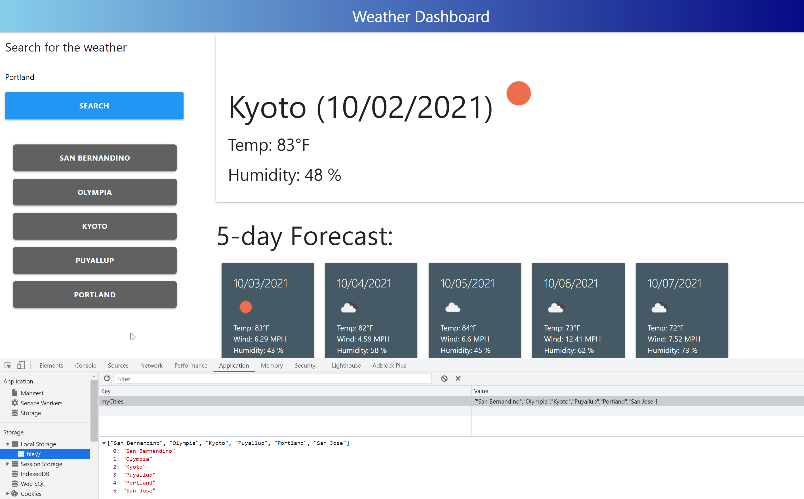

# weather_dashboard
## Description
This project had the objective of learning to work with making calls to an API and displaying the results on the page. The OpenWeather API was used to make a weather dashboard that displays the current weather and five day forecast for a city which is provided by the user as a search query. Through doing this project, I learned how to interpret the data from the OpenWeather API requests and how to manipulate it and place it on the page. The Materialize css library was used for the styling. Learing how to use these elements was also a result of completing this assignment.
## Table of Contents 
- [Installation](#installation)
- [Usage](#usage)
- [Credits](#credits)
## Installation
The page can be accessed through [this link](https://jmarq019.github.io/weather_dashboard/).
## Usage
The user types the name of a city into the search bar and the weather information is displyed. The searches get saved as a list of clickable buttons. They can be clicked to display the corresponding weather information. These past search information is saved in the browser's local sotrage.

    

## Credits
Credits to the lessons taught by the UW coding bootcamp TA's, instructor and tutors. Credits also go to the OpenWEather API documentation, the moments js library documentation and the Materialize library documentation.
## Tests
Testing was done directly on the page.