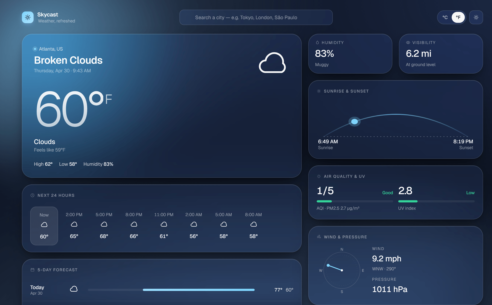

# weather_dashboard
## Description
This project had the objective of learning to work with API calls and displaying the results on the page. The OpenWeather API was used to build a weather dashboard that displays the current weather and a five-day forecast for a city provided by the user as a search query. Through this project, I learned how to interpret data from the OpenWeather API and how to manipulate and display it on the page. The project was originally built using jQuery and the Materialize CSS library for styling.

The application was later redesigned through Claude Design into a modern React-based application. The redesign introduced a glassmorphic UI with dark and light theme support, an hourly forecast panel, air quality index, UV index, a wind rose, a recent searches list, and a tweaks panel for user customization. The deployment was also updated to use Vercel with a secure environment variable build step for the API key.
## Table of Contents 
- [Installation](#installation)
- [Usage](#usage)
- [Credits](#credits)
## Installation
The page can be accessed through [this link](https://weather-dashboard-rust-eight.vercel.app/).
## Usage
Type a city name into the search bar at the top of the page and press Enter to load its weather data. The dashboard updates with the following information:

- **Current conditions** — Temperature, feels-like, daily high/low, humidity, and a weather condition icon. The page background shifts to match the current weather mood (clear, cloudy, rain, snow, or storm).
- **Hourly forecast** — A scrollable strip showing conditions and temperature for the next 24 hours in 3-hour intervals.
- **5-day forecast** — Daily high/low temperatures displayed with a relative temperature bar and weather icons.
- **Sunrise & sunset** — An animated arc showing how far through the day the sun currently is, with exact sunrise and sunset times.
- **Air quality & UV** — AQI on a 1–5 scale with a PM2.5 reading, and an estimated UV index with a severity label.
- **Wind & pressure** — A compass showing wind direction, speed, and cardinal heading alongside the atmospheric pressure.
- **Humidity & visibility** — Stat tiles showing current humidity with a comfort label (Dry, Pleasant, Comfortable, or Muggy) and ground-level visibility.
- **Location map** — A stylized map pin showing the city's coordinates.

**Recent searches** are saved automatically (up to 6 cities) and appear in a panel on the right. Clicking a recent city reloads its weather. Individual entries can be removed with the X button. All searches and preferences are persisted in the browser's local storage.

**Controls in the top bar:**
- The **°C / °F** toggle switches temperature and wind speed units across the entire dashboard.
- The **sun/moon icon** switches between light and dark themes.

**Tweaks panel** (accessible via the settings icon): provides additional controls for theme, units, a condition preview override to test each weather mood visually, and a choice of six accent colors with a custom color picker option.

## Credits
Credits to the lessons taught by the UW coding bootcamp TAs, instructor, and tutors. Credits also go to the OpenWeather API documentation, the Moment.js library documentation, and the Materialize library documentation. The modern redesign was completed with the assistance of Claude Design by Anthropic.
## Tests
Testing was done directly on the page.